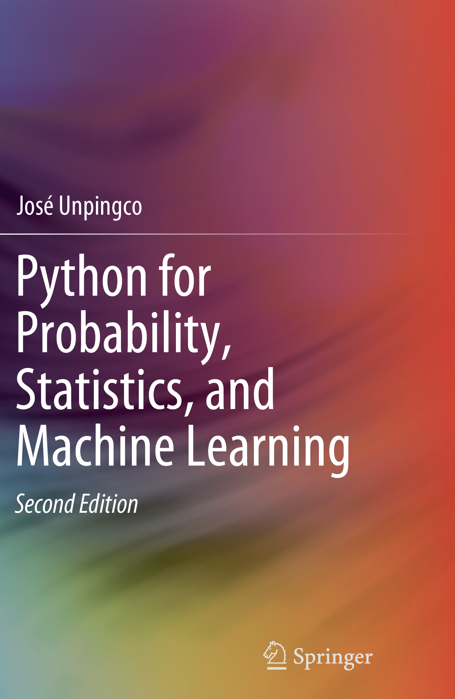

# Python-for-Probability-Statistics-and-Machine-Learning-2E

Second edition of [Springer text **Python for Probability, Statistics, and Machine Learning**](https://www.springer.com/gp/book/9783030185442)

This book, fully updated for Python version 3.6+, covers the key ideas that link probability, statistics, and machine learning illustrated using Python modules in these areas.  All the figures and numerical results are reproducible using the Python codes provided. The author develops key intuitions in machine learning by working meaningful examples using multiple analytical methods and Python codes, thereby connecting theoretical concepts to concrete implementations. Detailed proofs for certain important results are also provided. Modern Python modules like Pandas, Sympy, Scikit-learn, Tensorflow, and Keras are applied to simulate and visualize important machine learning concepts like the bias/variance trade-off, cross-validation, and regularization. Many abstract mathematical ideas, such as convergence in probability theory, are developed and illustrated with numerical examples. 

This updated edition now includes the Fisher Exact Test and the Mann-Whitney-Wilcoxon Test. A new section on survival analysis has been included as well as substantial development of Generalized Linear Models. The new deep learning section for image processing includes an in-depth discussion of gradient descent methods that underpin all deep learning algorithms.   As with the prior edition, there are new and updated *Programming Tips* that the illustrate effective Python modules and methods for scientific programming and machine learning. There are 445 run-able code blocks with corresponding outputs that have been tested for accuracy.  Over 158 graphical visualizations (almost all generated using Python) illustrate the concepts that are developed both in code and in mathematics. We also discuss and use key Python modules such as Numpy, Scikit-learn, Sympy,  Scipy, Lifelines, CvxPy, Theano, Matplotlib, Pandas, Tensorflow, Statsmodels,  and Keras.

This book is suitable for anyone with an undergraduate-level exposure to probability, statistics, or machine learning and with rudimentary knowledge of Python programming.

## Conda setup instructions

If you are using `conda`, you can get started by cloning this 
repository and using the `environment.yaml` file as in the 
following:

    conda env create -n pyPSML -f environment.yaml

and then activate the environment using the following,

    conda activate pyPSML

Then, you can run `jupyter notebook` and navigate the Jupyter
notebooks for the individual chapters. All of the notebooks are fully
functional in this so-created environment. Note that there are
embedded figures in the Jupyter notebooks that are meant to validate
the outputs of the Matplotlib codes therein.

## Docker setup instructions

If you are using docker, there is a `Dockerfile` included. After cloning
this repository, you can build the image with the following,

    docker build -t pypsml2e .

and then run it locally using,

    docker container run -it -p 8888:8888 pypsml2e

Then, navigate to the output URL and you can explore the Jupyter
notebooks for each chapter. Alternately, if you don't want to build
your own image, you can do

    docker run -p 8888:8888 unpingco/pypsml2e

to get the docker image from
https://hub.docker.com/r/unpingco/pypsml2e. Note that this may
**not** be as up-to-date as building it yourself from this
repository, but should still work fine.

Your comments (including errata) are welcome in the [Issues](https://github.com/unpingco/Python-for-Probability-Statistics-and-Machine-Learning-2E/issues) link above.

Good luck! I hope you find these materials helpful.
